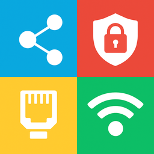
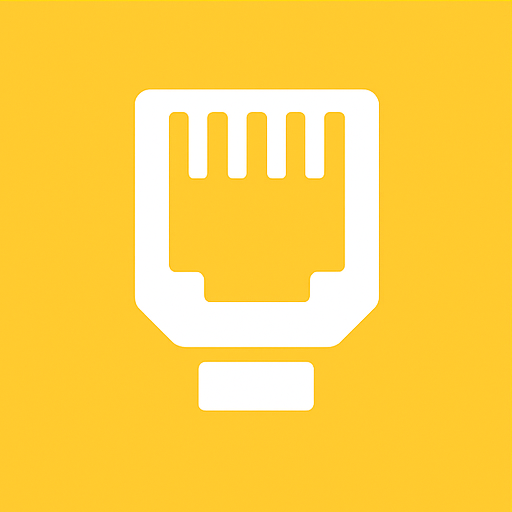

<p align="center">
  
</p>

# CP-Tekniker Device Management App

A modern, secure, and user-friendly device management solution for NorgesGruppen, built with Flask and designed for Docker. The app is now modularly organized for easy further development and collaboration.

---

## Main Features

- **Email-based authentication** with one-time code
- **Role-based access**: Actions are filtered by user roles (exact email > domain match)
- **Fetch and create device**: Search by MAC address, create new devices
- **Rate limiting**: Protects against abuse
- **Modern UI**: Tailwind CSS, Lucide icons
- **Runs in Docker**: Simple, reproducible deployment

---

## New Folder & Module Structure

```
app.py                  # Flask app entrypoint, blueprint registration, error handler
config.py               # All configuration and .env handling
approved_domains.json   # Approved emails/domains and roles
requirements.txt        # Python dependencies
Dockerfile              # Docker build instructions
supervisord.conf        # Runs Redis and Flask app in same container

auth/                   # Authentication and rate limiting
    limiter.py          # Flask-Limiter setup (Redis)
    routes.py           # Auth endpoints (Blueprint)
    utils.py            # Auth helper functions

clearpass/              # ClearPass API and role logic
    api.py              # API calls and device endpoints (Blueprint)
    roles.py            # Role and domain handling
    routes.py           # Role endpoint (Blueprint)

utils/
    redis.py            # Redis client

templates/
    index.html          # Frontend

static/
    favicon.ico/png     # Icons
```

---

## Configuration Files

- **.env**: Environment variables for API, SMTP, and Flask.

  **Example .env:**
  ```env
  BASE_URL=https://clearpass.ngdata.no
  CLIENT_ID=app
  CLIENT_SECRET=your_clearpass_secret
  SMTP_SERVER=ngmailscan.joh.no
  SMTP_PORT=25
  SMTP_FROM=cp-noreply@ngdata.no
  SMTP_FROM_NAME=NorgesGruppen ClearPass code
  FLASK_SECRET_KEY=your_flask_secret
  REDIS_URL=redis://localhost:6379/0
  ```

- **approved_domains.json**: List of approved emails/domains and their roles.

  ### About approved_domains.json
  The `approved_domains.json` file defines which emails and domains are approved for login, and which roles they have access to. Each entry can be an exact email address or a domain, and has an associated list of roles.

  **Example content:**
  ```json
  [
    {
      "email": "john.doe@company.com",
      "roles": []
    },
    {
      "email": "company.com",
      "roles": [
        { "role_id": 9901, "role_name": "STORE-VLAN1" },
        { "role_id": 9902, "role_name": "STORE-VLAN60" }
      ]
    },
    {
      "email": "jane.doe@hotmail.com",
      "roles": [
        { "role_id": 9903, "role_name": "STORE-VLAN151 CustomerNet" },
        { "role_id": 9906, "role_name": "STORE-VLAN140 Clients" }
      ]
    }
  ]
  ```
  - If "email" contains a full email address, the entry applies only to that user.
  - If "email" is just a domain (e.g. `company.com`), the entry applies to all users with an email in that domain.
  - "roles" is a list of objects defining which ClearPass roles the user or domain has access to.
  - Exact email match always takes precedence over domain match.

  This provides flexible and secure control over who can log in and which roles they are granted.

- **Dockerfile**: Builds a minimal, production-ready Python/Flask image with all dependencies and supervisord for process management. Ensures the app runs identically in all environments.

- **supervisord.conf**: Configures supervisord to start both Redis and the Flask app (via Gunicorn) in the same container. Provides robust process management and easy startup.

- **requirements.txt**: Lists all Python dependencies for the project (e.g. Flask, Flask-Session, requests, redis, python-dotenv, gunicorn). Used by Dockerfile and for local development.

- **templates/index.html**: The app's frontend. Modern, responsive web interface with Tailwind CSS and Lucide icons. Communicates with the backend via defined API endpoints.

- **config.py**: Central configuration file for the entire application. Reads environment variables from .env and makes them available via the Config class. Used for managing API keys, SMTP, Redis, etc.

---

## How it works

1. **Login**: The user enters their email. If the email/domain is approved, a one-time code is sent. Entering the code logs the user in.
2. **Role fetching**: After login, only the roles the user has access to are fetched (exact email has highest priority).
3. **Device management**: The user can fetch device info or create new devices, depending on their roles.
4. **Rate limiting**: All sensitive endpoints are protected against abuse.

---

## Getting Started (Docker)

1. **Clone the repo:**
   ```sh
   git clone <repo-url>
   cd cp-tekniker-app
   ```
2. **Configure environment:**
   - Edit `.env` with your ClearPass API and SMTP settings.
   - Edit `approved_domains.json` to specify allowed emails/domains and roles.
3. **Build and run with Docker:**
   ```sh
   docker build -t cp-tekniker-app .
   docker run -p 8000:8000 --env-file .env -v $(pwd)/approved_domains.json:/app/approved_domains.json cp-tekniker-app
   ```
   The app will be available at [http://localhost:8000](http://localhost:8000)

---

## Security & Best Practices

- No passwords stored, only one-time code
- Sessions are server-side and expire after 8 hours
- Roles are strictly enforced
- Rate limiting on all sensitive endpoints
- All configuration in `.env` (never in git)

---

## Troubleshooting

- **Not receiving email?** Check SMTP settings and that your email/domain is in `approved_domains.json`.
- **Role missing?** Check that your email/domain has the correct roles in `approved_domains.json`.
- **File not found?** The app expects `approved_domains.json` to be present in the container at `/app/approved_domains.json`.

---

## API Documentation (Swagger/OpenAPI)

You can view and interact with the API documentation using Swagger Editor:

- [Open Swagger Editor](https://editor.swagger.io/)
- In Swagger Editor, click "File" → "Import File" and select `openapi.yaml` from this repository.
- Or, copy the contents of `openapi.yaml` and paste it into the editor window.

This gives you a live, interactive view of all API endpoints and schemas.

---

## About the logo and its symbolism

Our logo consists of four colored quadrants that together illustrate the core areas of the network group:

<table>
  <tr>
    <td align="center"></td>
    <td align="center"></td>
    <td align="center"></td>
    <td align="center"></td>
  </tr>
  <tr>
    <td align="center"><b>Planning and Structure</b></td>
    <td align="center"><b>Security and Control</b></td>
    <td align="center"><b>Installation and Physical Operations</b></td>
    <td align="center"><b>Mobility and Accessibility</b></td>
  </tr>
</table>

These four symbols together form a complete picture of what the network group works with:

- <b>Planning and Structure</b> : Strategic planning, design, and structuring of networks.
- <b>Security and Control</b> : Focus on security, access control, and monitoring.
- <b>Installation and Physical Operations</b> : Practical installation, cabling, and physical infrastructure.
- <b>Mobility and Accessibility</b> : Wireless solutions, flexibility, and user accessibility.

The logo symbolizes that we cover the entire spectrum from planning to daily operations and accessibility.

---

## License

Proprietary. For use by NorgesGruppen and authorized personnel only.
